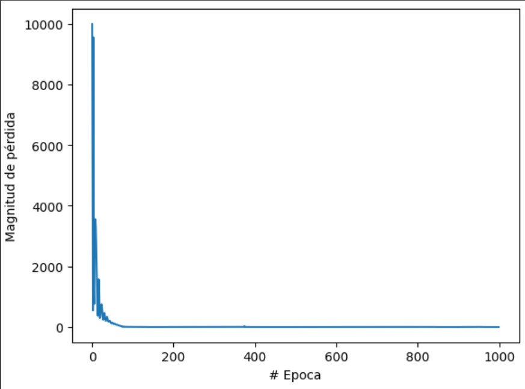
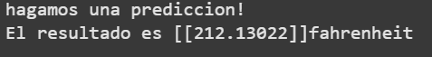

# Celsius-to-Fahrenheit Converter (TensorFlow)

Pequeño proyecto que muestra cómo entrenar una red neuronal en Keras para aproximar la fórmula de conversión de temperaturas.  
Sirve como ejemplo mínimo de:

* Manejo de tensores con **NumPy**.  
* Definición y entrenamiento de un modelo **Sequential** en **TensorFlow / Keras**.  
* Visualización de la evolución de la pérdida con **Matplotlib**.  

---

## Grafico

 

---

## Resultado

---

## Requisitos

- tensorflow >= 2.11
- numpy
- matplotlib

---
